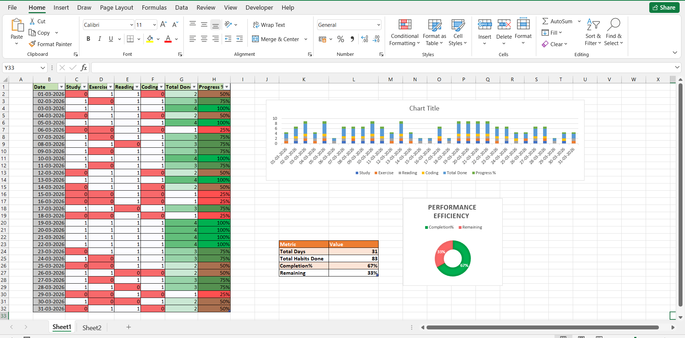

# 📊 Habit Performance Analytics Dashboard (Excel)

##  Dashboard Preview
  
 

##  Project Overview

This project is a **Habit Performance Analytics Dashboard** developed in Microsoft Excel to analyze daily productivity patterns over a 31-day period.

The dashboard transforms raw habit tracking data into structured performance insights using formulas, percentage metrics, and visual analytics.

##  Objective

To design a data-driven system that:

- Track daily habit completion  
- Calculate performance metrics  
- Visualize productivity trends  
- Measure overall consistency  

##  Dataset Structure

The dataset consists of:

- 31 Days of activity tracking  
- 4 Core Habits:
  - Study  
  - Exercise  
  - Reading  
  - Coding  
- Binary Input System (1 = Completed, 0 = Not Completed)

##  Key Metrics Calculated

- Total Habits Completed (Daily)  
- Daily Productivity %  
- Overall Completion Rate  
- Remaining Completion %  

### Formulas Used

- `COUNTIF()` for completion aggregation  
- Percentage calculations for performance scoring  

##  Dashboard Components

###  Performance Table

- Daily habit tracking across the month  
- Auto-calculated totals and progress indicators  
- Conditional formatting for visual performance signals  

###  Summary Analytics Panel

- Total Days  
- Total Habits Completed  
- Overall Completion %  
- Remaining %  

###  Data Visualization

- Bar Chart for productivity comparison  
- Color-coded heat-style tracking  
- Performance progression across dates  

---

##  Tools & Techniques Used

- Microsoft Excel  
- Data Aggregation (`COUNTIF`)  
- Performance Metrics Calculation  
- Conditional Formatting  
- Data Visualization (Column Chart)  
- Dashboard Structuring  

##  Insights Generated

- Identified high and low productivity days  
- Measured habit consistency trends  
- Evaluated overall monthly discipline score  
- Visualized daily output fluctuations  

##  Skills Demonstrated

- Data Cleaning & Structuring  
- KPI Calculation  
- Analytical Thinking  
- Dashboard Design  
- Visual Data Communication  

##  Future Enhancements
 
- Habit-wise Performance Comparison  
- Streak Detection System  
- Monthly Dynamic Dashboard  
- Pivot Table-Based Analysis

##  Purpose

This project was built to practice and strengthen my foundational Excel skills by creating a real-world productivity tracking dashboard using formulas and charts.
